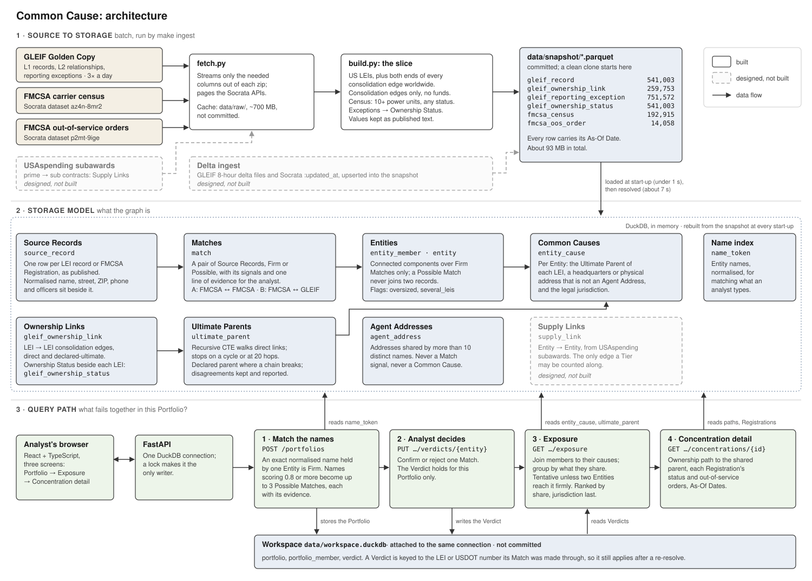

# Architecture

Dashed boxes are designed and not built. Terms in **bold** are defined in [`CONTEXT.md`](../../CONTEXT.md).

## 1. Source to storage

`make ingest` runs once, by hand. `fetch.py` downloads the latest GLEIF Golden Copy and pages the two FMCSA datasets into `data/raw/`. `build.py` cuts the slice described in [`DECISIONS.md`](../../DECISIONS.md) entry 4 and writes one Parquet file per table to `data/snapshot/`, which is committed. Nothing downstream fetches anything, so a clean clone starts from the snapshot.

Values are kept as the registry published them, as text. The one derived table is `gleif_ownership_status`, the three-state **Ownership Status** read from reporting exceptions ([`ASSUMPTIONS.md`](../../ASSUMPTIONS.md) gap 2).

**Designed, not built:**

- **Delta ingest.** GLEIF publishes delta files every 8 hours. Socrata exposes `:updated_at` on every row. A scheduled job would fetch only what changed, upsert it into the snapshot by LEI and USDOT number, and re-resolve only the blocks those rows touch. The snapshot would then move out of git into object storage. It is not built because freshness is capped by the sources' own cadence ([`ASSUMPTIONS.md`](../../ASSUMPTIONS.md) gap 3), and a batch rebuild takes seconds at this size.
- **USAspending subawards.** Prime-to-subcontractor award records are the one free, structured source of real **Supply Links** found (US federal contracts only). They would load into a `supply_link` table between **Entities**, and a **Tier** would be counted along those edges and no others. Not built because the matching work behind it is the same size again as the FMCSA-to-GLEIF join.

## 2. Storage model

At start-up the API loads the snapshot into an in-memory DuckDB database and resolves it there (about 8 seconds). The graph is rebuilt every time, so a rule change needs no migration ([`docs/adr/0001-duckdb-as-the-graph-store.md`](../adr/0001-duckdb-as-the-graph-store.md)).

- **Source Records** (`source_record`) are never edited. Normalised forms sit beside the published values.
- **Matches** (`match`) pair two Source Records, with a band (Firm or Possible), the signals behind it and one line of evidence.
- **Entities** (`entity_member`, `entity`) are connected components over Firm Matches. A Possible Match never joins two records.
- **Ownership Links** (`gleif_ownership_link`) run from LEI to LEI. `ultimate_parent` walks them with a recursive CTE.
- `entity_cause` holds, for each Entity, everything it could share with another: an **Ultimate Parent**, an address that is not an **Agent Address**, a jurisdiction. Finding a **Hidden Concentration** is then a group-by, not a traversal.

The only writes at runtime are Portfolios and **Verdicts**. They go to `data/workspace.duckdb`, attached to the same connection, so they outlive a restart and a re-resolve.

## 3. Query path

The analyst's question is "which of these names would fail together?".

1. **Match the names.** `POST /portfolios` normalises each name as Source Records are normalised and looks it up in `name_token`. An exact name held by exactly one Entity is a **Firm Match**. Near names become up to three **Possible Matches**, each with its evidence.
2. **Analyst decides.** A Verdict confirms or rejects one Match, for this Portfolio only.
3. **Exposure.** Each member's Firm or confirmed Match (or, failing that, its Possible Matches) is joined to `entity_cause` and grouped by what is shared. A Concentration is **tentative** unless two different Entities reach it firmly. They are ranked by share of the Portfolio, with shared jurisdictions last.
4. **Concentration detail.** The ownership path from each member to the shared parent, each Registration with its status and out-of-service orders, and the **As-Of Date** of every source.

Matching a 25-name Portfolio takes about 40 ms and its exposure about 60 ms.
